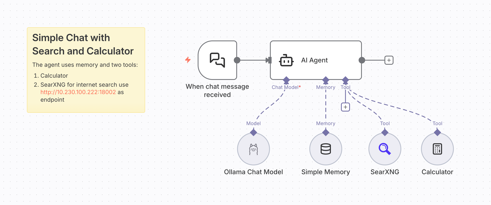

# Chat-bot with Calculator and Search

Create a new workflow in n8n and select "Import from File"



The agent is able to perform calculations and search the Internet for information. The following example dialog test both: the agent needs to lookup the current exchange rate and then perform exact calculations.

**User:** I want to by a souvenir in Germany for 100 euros, the credit card company will charge 2% foreign exchange fee. How much does the souvenir cost me in US dollars. Use the current exchange rate.

**AI:**
```
Cost in US dollars
Item	Amount (EUR)	Calculation
Souvenir	€ 100	–
Foreign exchange fee (2 %)	€ 2	0.02 × 100
Total in euros	€ 102	100 + 2
Current EUR→USD rate (≈ 1 USD = € 0.8644)	–	1 ÷ 0.8644 ≈ 1.156 USD per €
Total in USD	≈ € 102 × 1.156 ≈ € 118	102 ÷ 0.8644 ≈ 118
So the souvenir will cost you about $118 (US dollars) when the 2 % foreign exchange fee is added.
```
**User:**
I'm also going to by two shirts for 49.99 Euros each. They are on sale for buy one get one half off. How much is that in US dollars

**AI:**
```
Cost of the two shirts (buy 1 get 1 half off)
Item	Price per shirt	Sale adjustment	Cost in €	Cost in USD
Shirt	€49.99	2nd shirt ½ off	49.99 + 24.995 = €74.985	74.985 × 1.156 ≈ $86.68
So the pair of shirts will cost you about $86.70 when converted at the current exchange rate (≈ 1 USD = € 0.8644, or 1 EUR ≈ 1.156 USD).
```

**User:**
Did you add the fee from the credit card?

**AI:**
```
No – the previous calculation only converted the discounted price.
If you add the 2 % foreign exchange fee on the € 74.985 you get:
1.	Fee = 0.02 × € 74.985 = € 1.4997
2.	Total in euros = € 74.985 + € 1.4997 = € 76.4847
3.	Convert to USD (≈ 1 USD = € 0.8644 → 1 EUR ≈ 1.156 USD)
€ 76.4847 × 1.156 ≈ $ 88.4 (rounded to the nearest cent)
So, with the credit card fee included, the two shirts cost about $88.40.
```