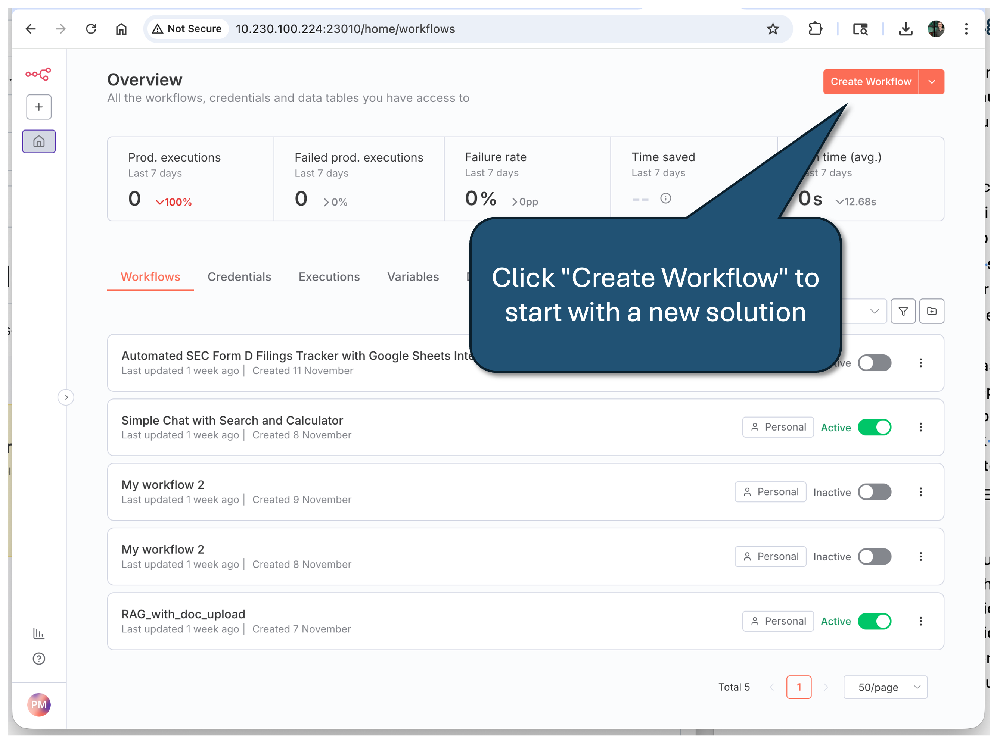
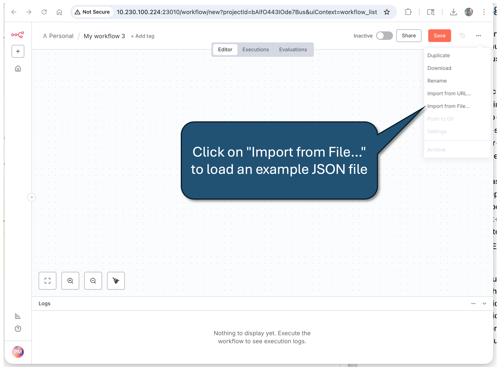
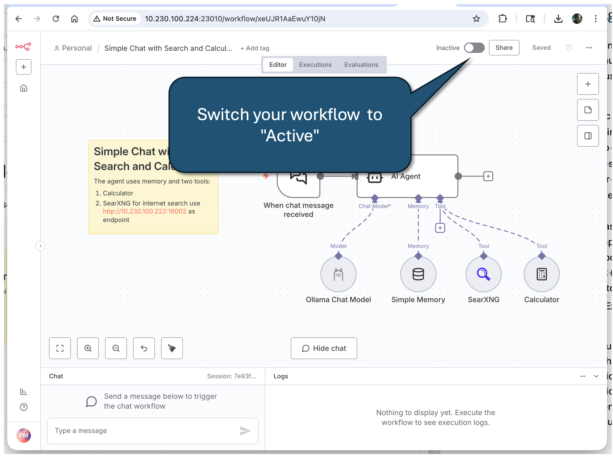
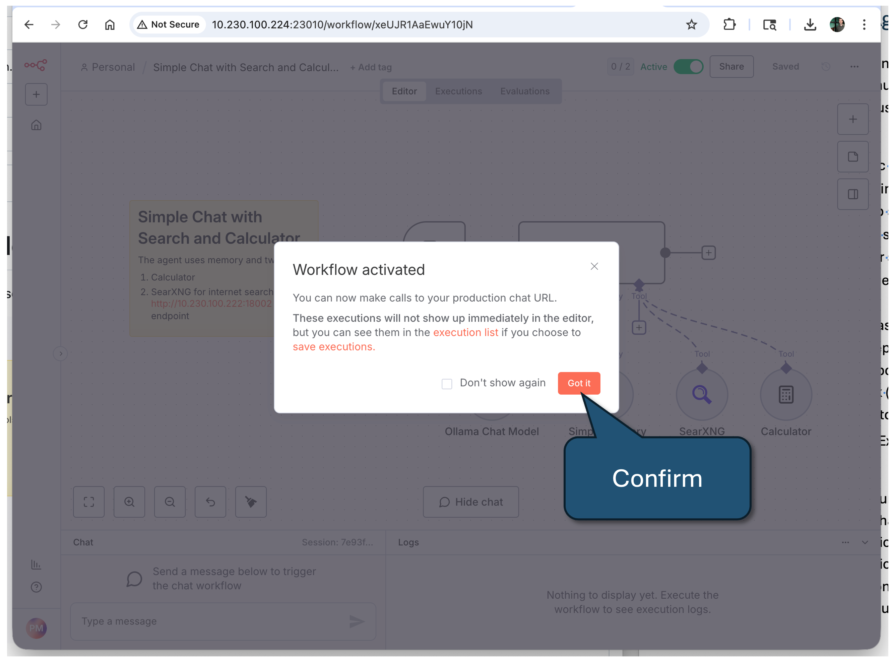
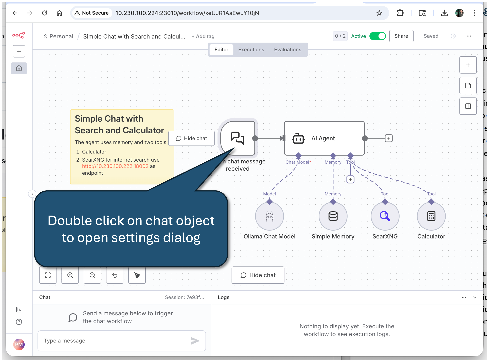
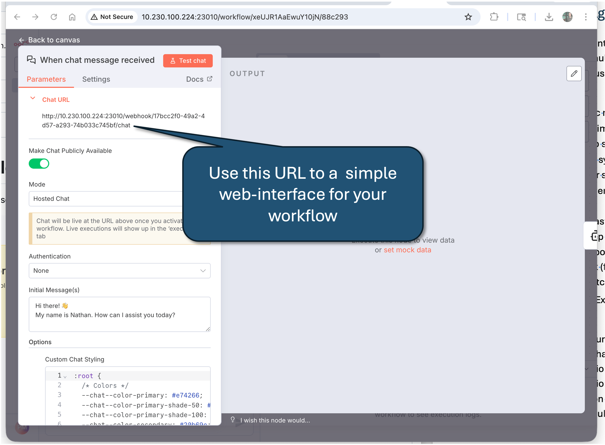

# N8N

## How to load an example workflow:
1. Download the JSON file
2. Create a new workflow
3. Select "Import from File..." from "..." menu in the upper right corner

## How to get the URL to my chat workflow:
1. Toggle switch on the upper right part of the window to "Active"
2. Open chat parameters and settings (double click on symbol)
3. The Chat URL is shown in the parameters tab; copy URL and open in another browser window or share with users.

