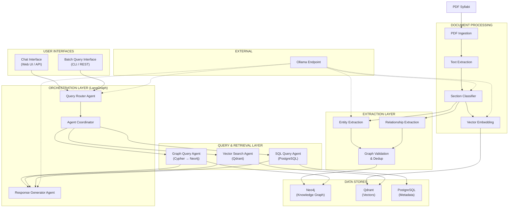
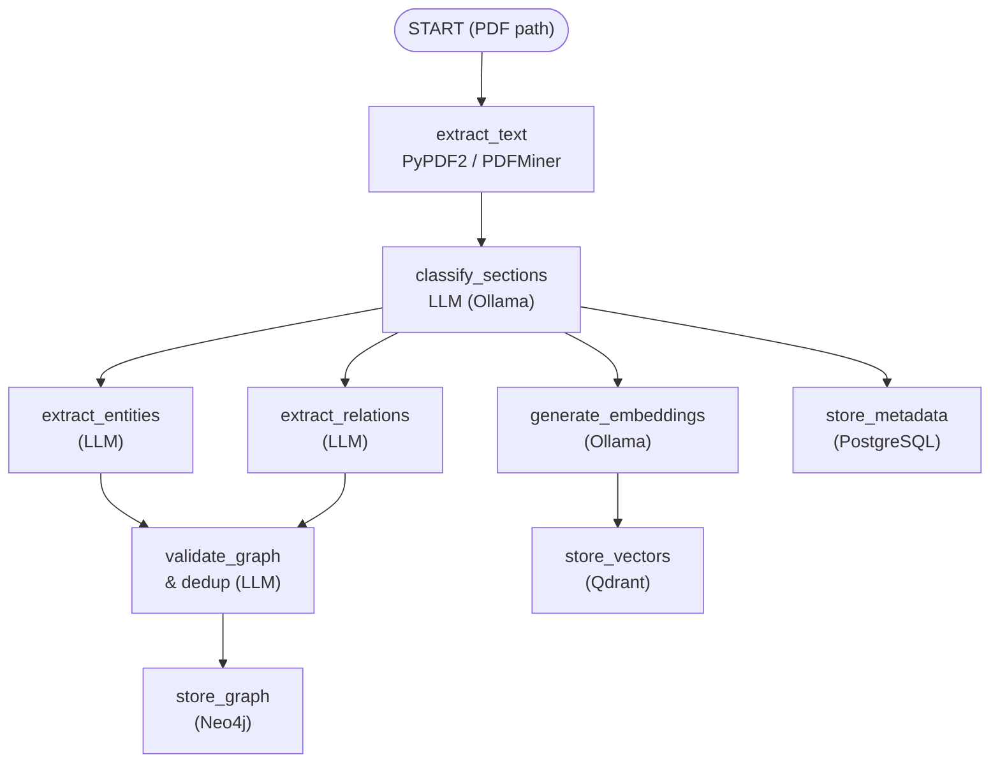
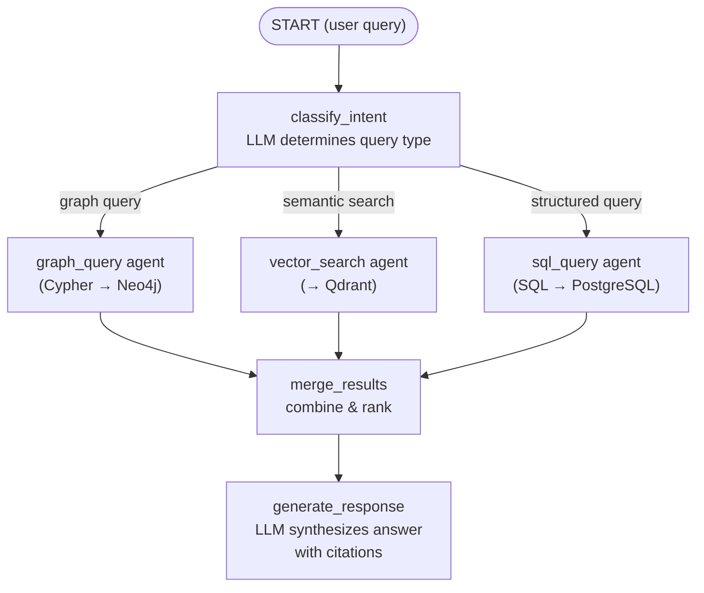
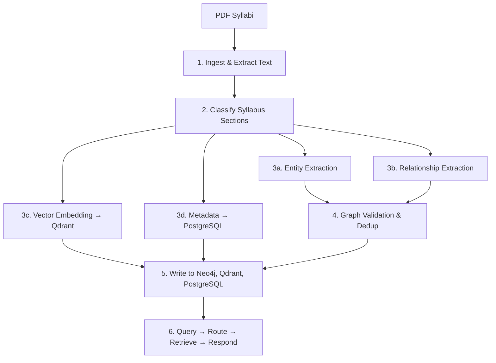

+++
title = "Syllabi Analysis — System Architecture"
description = "Knowledge Graph Intelligence system for GSU syllabi analysis"
weight = 100
outputs = ["Reveal"]
math = true
thumbnail = "/imgs/slides/chalk-board.png"

[reveal_hugo]
custom_theme = "css/reveal-robinson.css"
slide_number = true
transition = "convex"
+++

# Syllabi Analysis

### System Architecture

**Variation A — Knowledge Graph Intelligence**

MSA 8700 — DAIS Project

---

## Project Overview

**System:** Syllabi Analysis DAIS

**Corpus:** Class syllabi from all GSU colleges and programs (PDF)

**Objective:** Build a semantic knowledge graph to enable querying about:

- Topics covered across courses and programs
- How instructors address AI usage policies
- Prerequisite chains and learning outcomes
- Cross-program coverage overlaps

---

## User Persona

### Academic Program Coordinator / Curriculum Analyst

**Context:** GSU Office of Academic Affairs or college-level curriculum committee

***

### Goals

- Identify which courses cover specific topics across GSU
- Compare how different programs address the same subject area
- Analyze AI usage policies across instructors and departments
- Map prerequisite dependencies and curriculum gaps
- Support accreditation by mapping learning outcomes to courses

***

### Pain Points

- Manually reviewing hundreds of syllabi is **infeasible**
- No structured, queryable representation of syllabi content exists
- Cross-program comparisons require scanning documents from **multiple colleges**

---

## Key Use Cases

| # | Use Case | Example Query |
|---|----------|---------------|
| 1 | Topic Coverage | *"Which courses cover NLP?"* |
| 2 | AI Policy Comparison | *"How do Robinson vs. Arts & Sciences address generative AI?"* |
| 3 | Cross-Program Overlap | *"What topics are shared between MS Analytics and MS CS?"* |

***

## Key Use Cases (cont.)

| # | Use Case | Example Query |
|---|----------|---------------|
| 4 | Prerequisite Chains | *"What is the prerequisite chain for advanced ML courses?"* |
| 5 | Learning Outcomes | *"Which courses list 'critical thinking' as an outcome?"* |
| 6 | Temporal Trends | *"Has AI policy language increased over the last 3 semesters?"* |

---

## Knowledge Graph Schema — Entities

| Entity Type | Key Attributes |
|-------------|---------------|
| **Course** | course_code, title, credit_hours, level |
| **Instructor** | name, department, college |
| **Program** | name, degree_type, college |
| **College** | name |
| **Topic** | name, category |
| **Learning Outcome** | description, bloom_taxonomy_level |
| **Textbook** | title, author, edition |
| **AI Policy** | policy_type, details |
| **Semester** | term, year |
| **Assessment Method** | type, weight_percent |

---

## Knowledge Graph Schema — Relationships

| Relationship | From → To |
|-------------|-----------|
| TAUGHT_BY | Course → Instructor |
| BELONGS_TO | Course → Program |
| OFFERED_BY | Program → College |
| COVERS_TOPIC | Course → Topic |
| HAS_OUTCOME | Course → Learning Outcome |
| USES_TEXTBOOK | Course → Textbook |
| HAS_AI_POLICY | Course → AI Policy |
| HAS_PREREQUISITE | Course → Course |
| OFFERED_IN | Course → Semester |
| USES_ASSESSMENT | Course → Assessment Method |

---

## System Architecture



---

## Document Processing Layer

| Component | Technology |
|-----------|-----------|
| **PDF Ingestion** | PyPDF2, PDFMiner |
| **Text Extraction & Chunking** | PDFMiner, custom logic |
| **Section Classifier** | LLM via external Ollama |
| **Metadata Extraction** | LLM + regex |
| **Vector Embedding** | Ollama (`nomic-embed-text`) |

Classifies syllabus text into semantic sections:
*course description, topics/schedule, AI policy, grading, learning outcomes, textbooks, prerequisites*

---

## Extraction & Graph Construction

| Agent | Purpose |
|-------|---------|
| **Entity Extraction** | Identify courses, instructors, topics, outcomes, textbooks, AI policies |
| **Relationship Extraction** | Infer COVERS_TOPIC, HAS_PREREQUISITE, TAUGHT_BY, etc. |
| **Graph Validation & Dedup** | Resolve duplicates, normalize topic names, enforce schema |

***

## Data Stores

| Store | Technology | Contents |
|-------|-----------|----------|
| **Knowledge Graph** | Neo4j | Entities and relationships |
| **Vector Store** | Qdrant | Text chunk embeddings |
| **Relational Store** | PostgreSQL | Metadata, raw text, AI policies, eval logs |

---

## Query & Retrieval Layer

| Agent | Purpose |
|-------|---------|
| **Graph Query Agent** | Natural language → Cypher queries against Neo4j |
| **Vector Search Agent** | Semantic search over syllabus chunks in Qdrant |
| **SQL Query Agent** | Structured queries against PostgreSQL metadata |

***

## Orchestration Layer

| Component | Purpose |
|-----------|---------|
| **Query Router** | Classify intent → route to graph, vector, SQL, or combination |
| **Agent Coordinator** | Manage multi-agent execution; merge results |
| **Response Generator** | Synthesize answer with citations to source syllabi |

---

## Technology Stack

| Layer | Technology |
|-------|-----------|
| Language | Python 3.11+ |
| LLM (generation) | External Ollama (`llama3.1`, `mistral`) |
| LLM (embeddings) | External Ollama (`nomic-embed-text`) |
| Agent Framework | **LangGraph** |
| LangChain | `langchain-ollama` (ChatOllama, OllamaEmbeddings) |
| PDF Processing | PyPDF2, PDFMiner |
| Knowledge Graph | Neo4j |
| Vector Database | Qdrant |
| Relational DB | PostgreSQL |
| Web API | FastAPI |
| Containers | Docker + Docker Compose |

---

## Why LangGraph?

Two distinct multi-step pipelines with conditional branching:

- **Nodes** = agent steps (extract, classify, embed, query, respond)
- **Edges** = transitions with conditional routing
- **State** = shared context passed between nodes

LangGraph's state-graph model maps naturally to both the **ingestion** and **query** pipelines.

---

## LangGraph — Ingestion Graph



---

## LangGraph — Query Graph



The conditional edge routes to **one, two, or all three** agents depending on query intent.

---

## Data Flow Summary



---

## Milestone Alignment

| Milestone | Deliverables |
|-----------|-------------|
| **M01** | Variation selection (A), persona, use cases, schema |
| **M02** | PDF ingestion pipeline, text extraction, section classification, embeddings, metadata to PostgreSQL, Docker Compose |
| **M03** | Multi-agent extraction pipeline → Neo4j; chat interface; batch query endpoint |
| **M04** | Evaluation test set (50–100 queries); baseline metrics; error analysis; 3+ improvement ideas |
| **M05** | Improved system; ablation study (graph vs. vector vs. hybrid); iteration report |
| **M06** | Deployed system; technical report; demo video; presentation |

---

## Evaluation Test Set

**Size:** 50–100 queries across 6 categories

| Category | Metric |
|----------|--------|
| Topic lookup | Precision, Recall, F1 |
| AI policy extraction | Exact match / LLM-judged |
| Cross-program comparison | LLM-judged quality (1–5) |
| Prerequisite reasoning | Graph path accuracy |
| Aggregation | Numerical accuracy |
| Temporal trend | LLM-judged quality |

Reference answers manually authored from 20–30 syllabi reviewed in full.

---

## Containerization

```yaml
services:
  neo4j:
    image: neo4j:5
    ports: [7474, 7687]
  qdrant:
    image: qdrant/qdrant
    ports: [6333]
  postgres:
    image: postgres:18
    ports: [5432]
  app:
    build: ./app
    depends_on: [neo4j, qdrant, postgres]
    environment:
      - OLLAMA_BASE_URL=http://<ollama-host>:11434
  web-ui:
    build: ./web-ui
    ports: [3000]
```

Ollama is **external** — not containerized locally.

All other components run as Docker containers via Docker Compose.

---

## Summary

- **Variation A** — Knowledge Graph Intelligence over GSU syllabi
- **Persona** — Curriculum Analyst needing cross-program insight
- **Stack** — LangGraph + Ollama + Neo4j + Qdrant + PostgreSQL
- **Two LangGraph pipelines** — Ingestion and Query with conditional routing
- **Evaluation** — 50–100 queries, 6 categories, multiple metrics
- **Deployment** — Fully containerized (except external Ollama)
